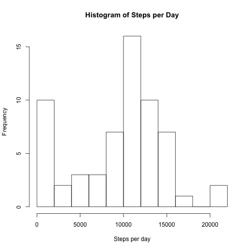
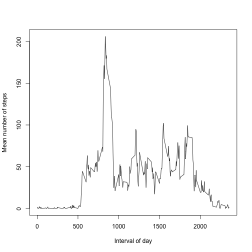
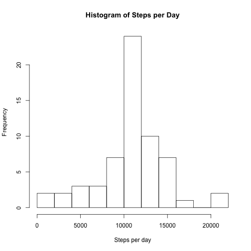
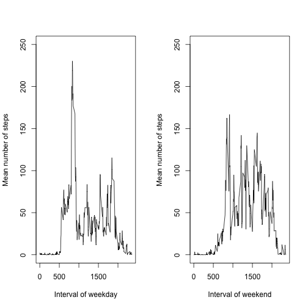

## Loading and preprocessing the data

Let's start by reading the CSV file and getting a high-level overview of the data:


```r
activity <- read.csv("~/coursera/RepData_PeerAssessment1/activity.csv");
head(activity);
```

```
##   steps       date interval
## 1    NA 2012-10-01        0
## 2    NA 2012-10-01        5
## 3    NA 2012-10-01       10
## 4    NA 2012-10-01       15
## 5    NA 2012-10-01       20
## 6    NA 2012-10-01       25
```

```r
summary(activity$steps);
```

```
##    Min. 1st Qu.  Median    Mean 3rd Qu.    Max.    NA's 
##    0.00    0.00    0.00   37.38   12.00  806.00    2304
```

## What is mean total number of steps taken per day?

To find mean steps per day, we'll use unique() to get a list of dates and subset() to find all the rows of the table for any given day. There are a lot of NA values so we'll strip those out before adding up each day's steps.


```r
dates <- unique(activity$date);
dailies <- sapply(dates, function(d) {
    sum(subset(activity, date==d & !is.na(activity$steps))$steps);
});
```

The mean steps per day is:


```r
print(mean(dailies))
```

```
## [1] 9354.23
```

While the median is:

```r
print(median(dailies))
```

```
## [1] 10395
```

Let's see that histogram:

```r
hist(dailies, breaks=10, xlab="Steps per day", main="Histogram of Steps per Day")
```

 

## What is the average daily activity pattern?

The code to get the mean steps for each interval is very similar logically to the code we used to get the total steps per day. We'll get a vector containing each interval value once, and for each of those interval values we'll take the subset of matching steps values (leaving out the NAs) and then take the mean of that subset.


```r
intervals <- unique(activity$interval)
avg.steps <- sapply(intervals, function(i) {
    mean(subset(activity, !is.na(steps) & interval == i)$steps)
});
```

For convenience let's make a data frame: the first column is the interval number (0, 5, 10, etc), and the second column is the average number of steps taken in that interval.


```r
interval.map <- data.frame(intervals, avg.steps);
head(interval.map)
```

```
##   intervals avg.steps
## 1         0 1.7169811
## 2         5 0.3396226
## 3        10 0.1320755
## 4        15 0.1509434
## 5        20 0.0754717
## 6        25 2.0943396
```

Plotting a time series of this gives us:


```r
plot(interval.map$intervals, interval.map$avg.steps,
     type="l", xlab="Interval of day", ylab="Mean number of steps")
```

 

The "flat" parts of this plot are a side effect fo the fact that the interval numbers are clock numbers -- for instance they jump straight from 855 to 900 (8:55 to 9:00). But "plot" assumes that intervals are normal integers with some ranges missing data.

There's a large spike sometime between 500 and 1000 -- let's find the peak using max():


```r
max.steps <- max(interval.map$avg.steps)
print( interval.map[interval.map$avg.steps == max.steps,c(1,2)])
```

```
##     intervals avg.steps
## 104       835  206.1698
```

The 835 interval (8:35 AM) contains the most steps on average.

## Imputing missing values

The number of missing steps values in the dataset is:


```r
print( length(activity[is.na(activity$steps), 1]) );
```

```
## [1] 2304
```

Let's replace each "NA" value with the average number of steps taken in a similar time interval on other days. So for example, a missing steps value for midnight will be filled in with the average number of steps taken at midnight on all the other days (should be close to zero) while a missing steps value for noon will be filled in with the average number of steps taken at noon on all the other days.

In case we need to refer to the original unmodified "activity" data frame, let's make our modifications to a deep copy:


```r
activity.corrected <- data.frame(activity);
```

For each row in interval.map, get the interval number and the avg steps, pick out all rows of activity with a null steps value and a matching interval number, and set their steps to the avg steps:


```r
for (i in seq(nrow(interval.map))) {
    ival <- interval.map[i, 1];
    avg <- interval.map[i, 2];
    missing <- is.na(activity$steps) & activity$interval == ival;
    activity.corrected[missing, 1] <- avg;
}

head(activity.corrected);
```

```
##       steps       date interval
## 1 1.7169811 2012-10-01        0
## 2 0.3396226 2012-10-01        5
## 3 0.1320755 2012-10-01       10
## 4 0.1509434 2012-10-01       15
## 5 0.0754717 2012-10-01       20
## 6 2.0943396 2012-10-01       25
```

I know using for loops is discouraged but i haven't found another way to do this. Making modifications inside an apply function doesn't work due to scope rules (changes don't stick after function exits). Another thing to add to my "R Gotchas".

Let's verify that this worked by counting the number of steps values that are NA. It should be zero:


```r
print( length(activity.corrected[is.na(activity.corrected$steps), 1]) );
```

```
## [1] 0
```

Recalculate our daily totals using the new data set:

```r
dailies.corrected <- sapply(dates, function(d) {
    sum(subset(activity.corrected, date==d )$steps);
});
```

Look at the new median, mean, and histogram:


```r
print(mean(dailies.corrected))
```

```
## [1] 10766.19
```

```r
print(median(dailies.corrected))
```

```
## [1] 10766.19
```

```r
hist(dailies.corrected, breaks=10, xlab="Steps per day", main="Histogram of Steps per Day")
```

 

After replacing the NA values with imputed values, the mean and median are now identical, which tells us the data now forms a symmetrical bell-curve distribution. The large spike at zero is now gone, which indicates that it was a statistical artifact resulting from missing data and not representative of "sick days" or any other real phenomenon.

## Are there differences in activity patterns between weekdays and weekends?

To make it easier to answer this question, let's add a column to our data frame which labels whether it's a weekday or weekend.

The dates were read as a Factor variable, but the 'weekdays' function expects date variables. We'll conver them by first turning them into character strings and then parsing those strings with strptime:


```r
days <- weekdays(strptime(as.character(activity$date), format="%Y-%m-%d"));
```

The 'weekdays' function returns a string like 'Saturday' etc:


```r
print(unique(days))
```

```
## [1] "Monday"    "Tuesday"   "Wednesday" "Thursday"  "Friday"    "Saturday" 
## [7] "Sunday"
```

So we'll fill in our new column with TRUE if the day is Saturday or Sunday and FALSE otherwise:

```r
activity.corrected$is.weekend <- (days == "Saturday" | days == "Sunday")
```

Re-do the code to find average steps per interval, this time running it once on just the weekdays and once on just the weekend days. Put the results into new columns of the interval.map frame:


```r
interval.map$weekend <- sapply(intervals, function(i) {
    matches <- subset(activity.corrected, is.weekend==TRUE & interval == i);
    mean(matches$steps);
});

interval.map$weekday <- sapply(intervals, function(i) {
    matches <- subset(activity.corrected, is.weekend==FALSE & interval == i);
    mean(matches$steps);
});
```

Here are the weekday and weekend plots side-by-side. (The y-axes forced to have the same range, to make the plots more easily comparable)


```r
par(mfrow=c(1,2))
plot(interval.map$intervals, interval.map$weekday, type="l",
     xlab="Interval of weekday", ylab="Mean number of steps",
     ylim=c(0, 250));
plot(interval.map$intervals, interval.map$weekend, type="l",
     xlab="Interval of weekend", ylab="Mean number of steps",
     ylim=c(0, 250))
```

 

The weekday data shows a large spike between 800 and 900 hours that's absent in the weekend data, probably representing a morning commute to work on weekdays. This is followed on weekdays by a relatively sedate period between 900 and 1800 hours. In contrast, on weekdays the steps are more evenly distributed throughout the day, indicating that activity can take place at any time with no particular pattern.
